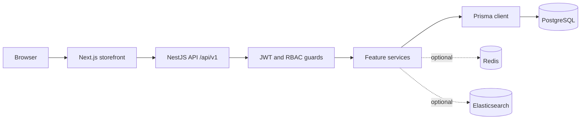

# ATVOO Developer Handbook

**Project:** ATVOO (AI-Based Most Modern Shopping Store)  
**Repository:** `imtiaz_mart`  
**Audience:** Developers, technical leads, QA engineers, DevOps engineers, and AI coding agents  
**Document status:** Current implementation guide with target-platform references  
**Last verified:** 2026-09-03  

This is the primary onboarding and operating guide for the ATVOO monorepo. It explains how the system is organized, how to run it, how to change it safely, and how to deploy it. The numbered documents in this directory remain the domain specifications. They describe product intent and technical requirements; this handbook records the relationship between those requirements and the code that exists today.

## How to use this handbook

Read the sections in order when joining the project. For a feature change, start with the relevant domain specification, inspect the owning module and schema, then follow the change checklist in this document.

Status labels used throughout this handbook:

| Label | Meaning |
| --- | --- |
| **Implemented** | Present in the repository and usable in the documented environment. |
| **Partial** | Some code exists, but important production behavior or integration work remains. |
| **Planned** | Described by the specifications but not yet implemented or not verified in code. |
| **Prerequisite** | Requires external infrastructure, credentials, provider approval, or an operational decision. |
| **Needs confirmation** | Documentation and implementation disagree or the behavior requires an explicit product decision. |

## Source-of-truth hierarchy

When sources disagree, use this order and document the discrepancy rather than silently guessing:

1. **Runtime configuration and source code** define current application behavior.
2. **`packages/database/prisma/schema.prisma` and migrations** define persisted data behavior.
3. **This handbook** defines supported developer and operational procedures.
4. **The numbered specifications** define intended product and architecture direction.
5. **Issue and roadmap material** defines future work only.

Never describe a planned feature as production-ready merely because its name appears in a specification or schema design list.

## Contents

1. [Project orientation](#1-project-orientation)
2. [Repository layout](#2-repository-layout)
3. [Prerequisites and local setup](#3-prerequisites-and-local-setup)
4. [Configuration and environment](#4-configuration-and-environment)
5. [System architecture](#5-system-architecture)
6. [Backend development](#6-backend-development)
7. [Frontend development](#7-frontend-development)
8. [Database development](#8-database-development)
9. [Business workflows](#9-business-workflows)
10. [Feature status](#10-feature-status)
11. [Security and compliance](#11-security-and-compliance)
12. [Testing and quality](#12-testing-and-quality)
13. [Deployment and operations](#13-deployment-and-operations)
14. [Troubleshooting](#14-troubleshooting)
15. [Change checklists](#15-change-checklists)
16. [Reference](#16-reference)

---

## 1. Project orientation

ATVOO is a multi-vendor marketplace with four principal product surfaces:

- **Public storefront:** product discovery, categories, brands, search, cart, checkout, and content pages.
- **Customer area:** account, orders, addresses, returns, reviews, rewards, wishlist, and saved commerce data.
- **Vendor area:** store profile, products, orders, analytics, payouts, and social automation controls.
- **Admin area:** marketplace operations, catalog, customers, orders, vendors, CMS, settings, analytics, and social/AI controls.

The platform direction also includes visual search, AI shopping-agent discovery, vendor social-media automation, loyalty, affiliates, analytics, notifications, support, and future mobile/PWA experiences.

### 1.1 Core principles

- Treat catalog and inventory data as canonical commerce data.
- Enforce authorization in the API; frontend checks are only for user experience.
- Prefer server components and server-side data access for public Next.js pages.
- Keep database changes migration-driven and reversible where practical.
- Make external integrations opt-in, observable, rate-limited, and independently disableable.
- Preserve vendor isolation: a vendor must only access resources owned by or assigned to that vendor.
- Keep customer, payment, OAuth, and operational secrets out of logs and source control.

### 1.2 User roles

| Role | Responsibility |
| --- | --- |
| Guest | Browse public content and maintain a guest cart using a session header. |
| Customer | Purchase products, manage account data, orders, reviews, returns, and rewards. |
| Vendor owner | Manage a vendor store, catalog, inventory, orders, staff, and eligible marketing features. |
| Vendor staff | Perform assigned vendor operations without owner-level access. |
| Affiliate | Refer traffic and receive eligible commissions. |
| Support agent | Handle customer and order support within assigned permissions. |
| Inventory manager | Manage stock, warehouses, reservations, and inventory operations. |
| Marketing manager | Manage CMS, campaigns, store social channels, and merchandising. |
| Finance manager | Manage payments, refunds, payouts, commissions, and financial reporting. |
| Admin | Manage platform operations within assigned RBAC permissions. |
| Super admin | Full platform administration and emergency controls. |

### 1.3 Revenue model and scope

The product specification names commissions, vendor subscriptions, sponsored placement, advertising, affiliate commissions, gift cards, memberships, and social automation add-ons as revenue streams. Each stream must be checked against the feature-status table before implementation or release planning.

---

## 2. Repository layout

```text
imtiaz_mart/
├── apps/
│   ├── web/                    Next.js 16 storefront and portals
│   └── api/                    NestJS 11 REST API
├── packages/
│   ├── database/               Prisma schema, migrations, client package
│   └── shared/                 Shared TypeScript types and constants
├── docs/                       Specifications and developer documentation
├── docker-compose.yml          Local PostgreSQL, Redis, Elasticsearch
├── package.json                Root workspace scripts and lifecycle hooks
├── package-lock.json           Canonical npm lockfile
├── vercel.json                 Storefront deployment configuration
└── .env.example                Environment variable template
```

### 2.1 Workspace responsibilities

**`apps/web`** owns the browser-facing experience. It uses the Next.js App Router, route groups, server components by default, client components where interaction requires them, and shared API/action helpers under `lib/`.

The vendor catalog currently includes a protected product list at `/vendor/products` and an edit route at `/vendor/products/[id]/edit`. The edit form updates product name, price, compare-at price, stock, status, description, and AI-commerce eligibility through the authenticated vendor API.

**`apps/api`** owns authentication, authorization, catalog, commerce, administration, integrations, and public machine-readable endpoints. Its global prefix is `/api`; URI versioning adds `/v1`, resulting in `/api/v1/...` for versioned endpoints.

**`packages/database`** owns the Prisma schema, migration history, generated Prisma client access, and seed scripts. It is imported by the API and must be generated before TypeScript compilation of the database package.

**`packages/shared`** owns types and constants shared by web and API. Keep it free of server-only dependencies and browser-only dependencies.

### 2.2 Dependency direction

The normal dependency direction is:

```text
web  ───────────────┐
                    ├── shared
api  ── database ───┘
```

The database package must not import application modules. Shared types must not import Prisma, NestJS, Next.js, or runtime secrets. Cross-layer imports should be explicit and limited to public package exports.

### 2.3 Important source locations

| Concern | Location |
| --- | --- |
| API module composition | `apps/api/src/app.module.ts` |
| API bootstrap, versioning, CORS, Swagger | `apps/api/src/main.ts` |
| API feature modules | `apps/api/src/modules/` |
| API guards and filters | `apps/api/src/common/` |
| Web routes | `apps/web/app/` |
| Web reusable UI | `apps/web/components/` |
| Web API/action helpers | `apps/web/lib/` |
| Shared exports | `packages/shared/src/index.ts` |
| Database schema | `packages/database/prisma/schema.prisma` |
| Database seeds | `packages/database/prisma/seed*.ts` |
| Local services | `docker-compose.yml` |
| Deployment config | `vercel.json`, `apps/api/Dockerfile` |

---

## 3. Prerequisites and local setup

### 3.1 Required tools

- Node.js 20 or newer. Use the repository's supported LTS release in development and CI.
- npm with workspace support.
- Docker Engine or Docker Desktop with Compose.
- Git.
- A PostgreSQL-compatible connection if Docker is not used.

Elasticsearch is optional for catalog search because the API includes a PostgreSQL fallback. Redis is used by application integrations and should be available for realistic local behavior.

### 3.2 First-time setup

Run from the repository root:

```bash
cp .env.example .env
npm ci
npm run docker:up
npm run db:migrate:deploy
npm run db:seed
```

For normal local development, `npm install` is also supported, but `npm ci` is the reproducible CI/deployment command.

Start the applications in separate terminals:

```bash
npm run dev:web
npm run dev:api
```

Default URLs:

| Service | URL |
| --- | --- |
| Storefront | `http://localhost:3000` |
| API base | `http://localhost:3001/api/v1` |
| Health endpoint | `http://localhost:3001/api/v1/health` |
| Swagger UI | `http://localhost:3001/api/docs` |
| Elasticsearch | `http://localhost:9200` |
| PostgreSQL | `localhost:5432` |
| Redis | `localhost:6379` |

Check containers with `docker compose ps`. Stop them with `npm run docker:down`. Named Docker volumes preserve local data between restarts.

### 3.3 Installation lifecycle

The root `postinstall` script runs in this order:

```text
shared build -> Prisma generate -> database build
```

Generation must happen before the database build because `packages/database/src/index.ts` imports `@prisma/client`. The Prisma CLI is a production dependency of `packages/database` because Vercel and other deployment environments may omit development dependencies while still executing `postinstall`.

If installation fails after a dependency or schema change:

```bash
npm ci
npm run generate --workspace=@imtiaz-mart/database
npm run build --workspace=@imtiaz-mart/database
```

Do not solve generated-client errors by committing `node_modules` or generated runtime artifacts.

### 3.4 Seed data

`npm run db:seed` creates roles, demo users, a demo vendor, a premium vendor subscription, catalog data, CMS data, and platform settings. Demo accounts are for isolated development/testing only:

| Account | Email | Password |
| --- | --- | --- |
| Admin | `admin@example.com` | `Admin123!` |
| Vendor | `vendor@example.com` | `Vendor123!` |
| Vendor staff | `vendor-staff@example.com` | `Vendor123!` |
| Customer | `customer@example.com` | `Customer123!` |
| Affiliate | `affiliate@example.com` | `Affiliate123!` |

Never seed these accounts into a public or production database. Replace or remove them before exposing a test environment.

### 3.5 Without Docker

Set `DATABASE_URL` to a PostgreSQL 17+ instance, then run migrations and seed as above. Redis and Elasticsearch URLs may point to managed or local services. Do not use local Docker hostnames or credentials in a deployed environment.

---

## 4. Configuration and environment

The root `.env.example` is the authoritative variable inventory. Do not commit `.env` or provider credentials.

### 4.1 Variable reference

| Variable | Consumer | Required | Notes |
| --- | --- | --- | --- |
| `DATABASE_URL` | API, Prisma | Yes | PostgreSQL connection string. |
| `REDIS_URL` | API | Local/production | Redis connection string. |
| `ELASTICSEARCH_URL` | API | Optional | Search enhancement; PostgreSQL fallback exists. |
| `ELASTICSEARCH_INDEX` | API | Optional | Catalog index name. |
| `NODE_ENV` | API/web | Yes | Use `production` only in deployed environments. |
| `API_PORT` | API | Local/host | Defaults to `3001`. |
| `API_URL` | API/integrations | Recommended | Public API origin. |
| `APP_URL` | API | Production | Public storefront origin used in links and feeds. |
| `CORS_ORIGIN` | API | Production | Comma-separated allowed storefront origins. |
| `NEXT_PUBLIC_API_URL` | Web | Yes | API URL ending in `/api/v1`. |
| `NEXT_PUBLIC_APP_URL` | Web/API | Yes | Public storefront URL. |
| `NEXT_PUBLIC_APP_NAME` | Web | Recommended | Display and metadata name. |
| `JWT_SECRET` | API | Production | Strong signing secret; never use `change-me`. |
| `JWT_REFRESH_SECRET` | API | Production | Separate strong refresh-token secret. |
| `JWT_EXPIRES_IN` | API | Recommended | Access-token lifetime, e.g. `15m`. |
| `JWT_REFRESH_EXPIRES_IN` | API | Recommended | Refresh-token lifetime, e.g. `7d`. |
| `SOCIAL_ENCRYPTION_KEY` | API | Social/production | At least 32 characters; encrypts OAuth material. |
| `STRIPE_SECRET_KEY` | API | Optional | Sandbox behavior exists when absent; production requires a payment decision. |
| `JAZZCASH_MERCHANT_ID` | API | Optional | Provider credential. |
| `EASYPAISA_STORE_ID` | API | Optional | Provider credential. |
| `PLATFORM_FEE_RATE` | API/seed | Recommended | Marketplace commission configuration. |
| `NEXT_PUBLIC_GOOGLE_CLIENT_ID` | Web | Optional | Browser OAuth client identifier. |
| `GOOGLE_CLIENT_ID` | API | Optional | Server OAuth client identifier. |
| `GOOGLE_CLIENT_SECRET` | API | Optional | Server OAuth secret. |

In production, `apps/api/src/app.module.ts` rejects missing, placeholder, or localhost values for key settings and requires a 32-character social encryption key. Treat this validation as a minimum, not a substitute for secret management.

### 4.2 Secret handling

Generate secrets with a password manager or a cryptographically secure generator. Store them in Vercel/API-host secret storage, not in repository files or shell history. Rotate compromised secrets, invalidate affected sessions/tokens, and record the incident.

---

## 5. System architecture

### 5.1 Request flow



Public machine-readable commerce endpoints are excluded from the global `/api` prefix and are served at the storefront origin by the API deployment, including `/.well-known/commerce-manifest.json`, `/llms.txt`, and `/feeds/*`. Confirm proxy/routing behavior when deploying the API separately.

### 5.2 API bootstrap

`apps/api/src/main.ts` configures:

- Global `/api` prefix.
- URI versioning with default version `1`, producing `/api/v1`.
- Public route exclusions for commerce manifest, feeds, and `llms.txt`.
- Global `ValidationPipe` with transformation, whitelist filtering, and rejection of unknown fields.
- CORS with comma-separated configured origins and credentials.
- Swagger at `/api/docs`.

`apps/api/src/app.module.ts` registers feature modules and global providers for the HTTP exception filter, throttling guard, JWT guard, and roles guard. New modules should follow the same registration and authorization model.

### 5.3 API module inventory

Current API module directories include:

`admin`, `affiliates`, `agent-commerce`, `auth`, `brands`, `cart`, `catalog`, `categories`, `cms`, `customers`, `dashboard`, `embeddings`, `feeds`, `health`, `loyalty`, `orders`, `payments`, `prisma`, `products`, `redis`, `returns`, `reviews`, `search`, `social-automation`, `uploads`, `vendors`, `visual-search`, and related supporting modules.

A directory name alone is not proof that every specification requirement is complete. Inspect controllers, services, DTOs, and integration configuration before relying on a capability.

### 5.4 Web route inventory

The App Router currently contains public and portal routes for about, account, admin, affiliate, authentication, blog, brands, careers, cart, categories, checkout, compare, contact, deals, FAQ, help, orders, pages, privacy, products, refund, returns, search, shipping, shop, terms, tracking, vendor, vendors, and visual search.

Dynamic routes include product/category/vendor/blog/page/order slugs and should preserve metadata, loading, error, and not-found behavior when changed.

---

## 6. Backend development

### 6.1 Module pattern

A feature normally belongs in `apps/api/src/modules/<feature>/` and should contain:

- A Nest module declaring imports, controllers, and providers.
- Controllers for transport and route decorators only.
- Services for business rules and orchestration.
- DTOs for validated input and output shaping.
- Guards/decorators for authentication and role checks where required.
- Repository-like query methods or a clear service boundary around Prisma access.

Do not place business logic in controllers. Do not trust IDs supplied by clients without applying ownership and authorization filters in the database query.

### 6.2 Endpoint conventions

- Versioned API routes use `/api/v1`.
- JSON responses should have consistent shapes and pagination metadata where lists are returned.
- Query parameters should support documented filtering, sorting, and pagination rather than ad hoc parsing per controller.
- Use DTO validation for body, path, and query data.
- Return appropriate HTTP status codes and allow the global exception filter to normalize errors.
- Apply `@Public()` only to endpoints that are intentionally public.
- Apply role checks at the API boundary for vendor/admin/finance/support operations.
- Use idempotency keys for payment, queue, publish, and other retryable mutation endpoints where the external contract requires them.
- Verify webhook signatures before processing provider payloads and make processing replay-safe.

### 6.3 Current endpoint groups

The exact contract is generated by Swagger and controllers. The specification groups endpoints as follows:

| Group | Examples |
| --- | --- |
| Auth | register, login, logout, refresh, password reset, Google OAuth |
| Catalog | products, categories, brands, search, recommendations, compare |
| Customer | profile, addresses, orders, wishlist, reviews, rewards, support |
| Vendor | profile, products, orders, inventory, payouts, staff, analytics |
| Cart/order | cart items, order creation, tracking, payment, return, refund |
| Admin | vendors, customers, orders, products, payments, reports, settings |
| CMS | pages, blogs, FAQs, banners, menus |
| AI commerce | manifest, UCP/ACP/Perplexity feeds, eligibility, feed status, attribution |
| Visual search | image search and result retrieval |
| Social automation | accounts, rules, queue, generation, approval, analytics, webhooks |

Use the running Swagger document as the authoritative list of implemented routes; do not add an endpoint to a reference table until its controller and behavior exist.

### 6.4 Adding an API feature

1. Read the relevant numbered specification and this handbook.
2. Identify the owning module and database models.
3. Define DTOs and authorization rules before implementing the service.
4. Add service methods with ownership, validation, and transaction boundaries.
5. Add controller routes and Swagger metadata.
6. Add or update shared response types if web consumers need them.
7. Add tests for success, invalid input, unauthenticated access, unauthorized ownership, and failure/retry paths.
8. Update this handbook only when the supported behavior is verified.

---

## 7. Frontend development

### 7.1 Next.js rules

- Use the App Router.
- Prefer Server Components for data loading and static page structure.
- Add `"use client"` only when state, event handlers, browser APIs, or client-only libraries require it.
- Keep secrets and server-only API calls out of client components.
- Use existing helpers under `apps/web/lib/` before introducing another API client.
- Preserve route-level metadata, loading states, error boundaries, and accessible empty states.
- Treat URL search parameters as part of the page contract for search, filters, pagination, and shareable views.

### 7.2 UI and accessibility

The design specification requires a premium, mobile-first, conversion-focused interface with WCAG 2.1 AA goals. In implementation:

- Use existing design tokens and component patterns.
- Maintain keyboard navigation, visible focus, semantic headings, labels, and screen-reader names.
- Do not rely on color alone for state or errors.
- Keep interactive controls usable at mobile widths.
- Preserve stable layout dimensions for product cards, grids, toolbars, and loading states.
- Add meaningful image alternative text and avoid exposing raw provider URLs as user-facing copy.

Treat the design-system specification as the intended visual contract, but verify actual tokens and components in `apps/web/app/globals.css`, `apps/web/lib/design-tokens.ts`, and `apps/web/components/` before extending them.

### 7.3 Adding a page

1. Identify whether the route is public, customer-protected, vendor-protected, or admin-protected.
2. Read the owning API controller/service and shared DTOs.
3. Add the route under `apps/web/app/` using the existing route-group conventions.
4. Keep data loading on the server when possible.
5. Add client components only for interactive islands.
6. Implement loading, error, empty, unauthorized, and not-found states.
7. Add metadata and structured data where the page represents indexable commerce content.
8. Check desktop and mobile layout, keyboard operation, and API failure behavior.
9. Build the web application before considering the change complete.

### 7.4 Authentication boundary

The browser may hide or redirect protected views for usability, but the API remains the authority. Every mutation must succeed or fail based on API authentication and authorization, not on the presence of a UI control.

---

## 8. Database development

### 8.1 Schema ownership

The Prisma schema at `packages/database/prisma/schema.prisma` is the persisted data contract. PostgreSQL is the primary database. The schema uses UUID identifiers, mapped database names where specified, timestamps, soft-delete fields in applicable models, relations, enums, and indexes.

The specification names domains for authentication, customers, vendors, catalog, inventory, orders, payments, marketing, engagement, CMS, notifications, support, analytics, audit, social automation, visual search, and AI commerce. Confirm each model in the actual schema before using it.

### 8.2 Migration workflow

For a schema change:

```bash
# edit schema.prisma
npm run db:migrate
npm run generate --workspace=@imtiaz-mart/database
npm run build --workspace=@imtiaz-mart/database
```

Use `npm run db:migrate:deploy` in deployment environments. Check state with `npm run db:migrate:status`. Do not edit an applied migration. Add a new migration for every change and consider how existing rows, indexes, nullability, and rollback behavior are handled.

For destructive or high-volume changes:

- Take a tested backup first.
- Separate data backfill from schema enforcement when possible.
- Deploy compatible application code before removing old columns or enum values.
- Measure lock time and table size.
- Document the rollback or forward-fix plan.

### 8.3 Prisma client and queries

The generated client is consumed through the database package and API Prisma module. Never commit generated `node_modules` output. Use transactions for multi-record commerce mutations such as order creation, stock reservation, payment state changes, commissions, and returns.

Always apply tenant/ownership conditions in the query. Soft-deleted records should not appear in normal reads. Use explicit select/include shapes to avoid leaking sensitive fields or creating unbounded joins.

### 8.4 Seeds and local reset

Seeds should be safe to run repeatedly where possible. They are not production migrations. To rebuild local Docker data, stop services and remove only the named local volumes after confirming data is disposable, then run migrations and seed again. Never remove a shared or production volume as a troubleshooting shortcut.

---

## 9. Business workflows

### 9.1 Authentication and authorization

1. A user registers or signs in through the web client.
2. The API validates input, verifies credentials/provider identity, and creates session/refresh state.
3. Access requests carry the access token and pass the global JWT guard.
4. Role-protected operations pass the roles guard and ownership checks.
5. Refresh and logout invalidate or rotate the appropriate token/session state.

Failure cases include duplicate email, invalid credentials, inactive/deleted user, expired token, missing role, and cross-vendor access. Do not return password hashes, refresh secrets, or provider tokens.

### 9.2 Product discovery and search

The storefront loads catalog data through API helpers. Public product results must exclude deleted/inactive records and apply availability/visibility rules. Search may use Elasticsearch when configured and falls back to PostgreSQL. Search and filter parameters must be bounded to prevent expensive unindexed queries.

Product detail pages should expose canonical metadata, images, price, variants, availability, vendor information, and relevant structured data. Product mutations belong to authorized vendor/admin services.

### 9.3 Guest cart and checkout

Guests use the `X-Cart-Session` header to identify a cart. Customers use authenticated ownership. Cart item add/update/delete operations must validate product/variant existence, availability, quantity limits, and vendor rules.

Order creation must re-read prices and inventory server-side, calculate totals and platform fees, reserve or decrement stock consistently, and be idempotent where retries are possible. Payment status must not be inferred from client input. Orders, shipments, refunds, and returns must preserve an auditable status history.

### 9.4 Vendor operations

Vendor owner/staff routes must verify vendor membership and permissions on every request. Product publication should validate required catalog data, media, pricing, inventory, and visibility flags. Vendor analytics must be scoped to that vendor. Payout calculations must be based on authoritative order/payment/refund state, not browser totals.

The current vendor product workflow supports create, list, edit, and archive operations. The web edit form is available at `/vendor/products/[id]/edit` and uses `PATCH /api/v1/vendor/products/:id`. Vendors can edit name, descriptions, category, pricing, stock, status, primary image URL, and AI-commerce eligibility. The API scopes reads and mutations to the resolved vendor store, so a product from another vendor is returned as not found, and it validates replacement categories before updating the foreign key. Multiple variant management and an admin approval queue remain follow-up work.

### 9.5 Admin operations

Admin actions are high-impact and must use RBAC, input validation, audit logging, and confirmation for destructive or financial operations. Prefer soft deletion and reversible state changes. Super-admin emergency controls should be explicit and observable.

### 9.6 AI-agent commerce

Current code provides public manifest and feed service paths and eligibility-aware product selection. The specifications also require protocol validation, feed freshness, attribution, kill switches, and fraud/dispute handling. Treat autonomous checkout and external partner certification as prerequisites until those controls are verified.

Recommended rollout:

1. Publish discovery-only feeds.
2. Validate product data, price, availability, images, shipping, and policy URLs.
3. Add attribution and feed health metrics.
4. Run partner validation and fraud/dispute exercises.
5. Enable agentic checkout only for explicitly approved products/vendors.
6. Keep a platform-wide disable switch and monitor stale or rejected feeds.

### 9.7 Visual search

The intended flow is upload/camera -> image embedding -> vector similarity -> ranked products -> logged query/results. The API and UI surfaces exist, but embedding providers, pgvector operations, background processing, threshold behavior, and production storage must be confirmed before claiming the full target flow is complete. No-match behavior should degrade to category/text search rather than an empty or misleading result.

### 9.8 Social automation

Social automation is opt-in and subscription-gated. The intended sequence is OAuth connection -> platform toggle -> rule -> AI draft -> moderation -> approval or scheduled publish -> provider adapter -> analytics. Provider credentials, official API permissions, encrypted tokens, rate limits, moderation, queue workers, retries, dead-letter handling, and deletion controls are production prerequisites.

Never auto-connect accounts, auto-publish without the configured consent mode, or bypass subscription checks in the frontend.

---

## 10. Feature status

This matrix separates the target platform from verified implementation. Recheck it when adding a major feature.

| Capability | Status | Verification/source note |
| --- | --- | --- |
| Next.js storefront and portal routes | Implemented | `apps/web/app/`, successful production build. |
| NestJS REST API and Swagger | Implemented | `apps/api/src/main.ts`, module controllers. |
| Prisma/PostgreSQL persistence | Implemented | Schema, migrations, generated client. |
| Docker PostgreSQL/Redis/Elasticsearch | Implemented for local use | `docker-compose.yml`; production hosting remains separate. |
| Authentication and JWT/RBAC guards | Partial | Core modules exist; production OAuth/operational hardening requires verification. |
| Catalog, categories, brands, products | Implemented/partial | Core services exist; review completeness against product-data requirements. |
| Cart and order flows | Implemented/partial | Core routes exist; payment, stock, and failure-path coverage must be validated. |
| Payment providers | Partial/prerequisite | Sandbox fallback and provider configuration exist; production provider contracts and reconciliation remain. |
| Vendor portal and operations | Partial | Product create/list/edit/archive plus category and primary-image editing is implemented with vendor ownership checks; multiple variants, permission granularity, and payout lifecycle remain. |
| Admin portal | Partial | Routes/modules exist; verify all destructive actions and audit coverage. |
| CMS | Partial | CMS module and seeded content exist; publishing workflow requires verification. |
| Reviews, wishlist, loyalty, affiliates, returns | Partial | Modules/types exist; verify end-to-end workflows and tests. |
| Elasticsearch catalog search | Partial | Optional integration with PostgreSQL fallback. |
| Visual search embeddings and vector ranking | Partial/planned | Surfaces and data direction exist; provider, jobs, pgvector, and thresholds require completion. |
| AI commerce manifest and feeds | Partial | Public service/controller paths exist; partner validation, freshness, attribution, and checkout are incomplete. |
| Agentic checkout | Planned/prerequisite | Requires payment rail, fraud/dispute controls, attribution, and partner approval. |
| Vendor social automation | Partial/prerequisite | API/UI direction exists; external OAuth/provider workers and compliance require validation. |
| Store social channel | Planned/partial | Specification and some supporting structures exist; verify complete implementation. |
| Notifications, support, broad analytics | Planned/partial | Data domains are specified; verify actual modules, providers, and UI before relying on them. |
| Durable media storage | Planned/prerequisite | Current upload behavior uses local disk; use object storage before production. |
| Mobile apps/PWA | Planned | Product direction only unless a separate implementation is added. |
| 80% automated test coverage | Target | Do not claim achieved without coverage output and maintained test suites. |

---

## 11. Security and compliance

### 11.1 Baseline controls

- Hash passwords with the existing approved password hashing implementation.
- Use separate strong JWT access and refresh secrets.
- Rotate and revoke refresh/session credentials after suspicious activity.
- Validate and whitelist request data with the global validation pipe.
- Enforce CORS to known origins; do not use wildcard credentials.
- Keep throttling enabled and tune limits with measured traffic.
- Enforce RBAC and resource ownership in API services.
- Encrypt OAuth tokens at rest and support immediate disconnect/revocation.
- Verify webhook signatures and reject replayed or duplicate events.
- Restrict upload type, size, content, and storage destination.
- Redact authorization headers, passwords, tokens, payment data, and sensitive PII from logs.
- Record audit events for administrative, financial, permission, integration, and content-publication actions.

### 11.2 Production blockers to resolve

- Replace local-disk uploads with durable object storage such as Cloudflare R2 or an equivalent.
- Configure managed PostgreSQL, Redis, and optional search infrastructure.
- Complete payment provider, webhook, reconciliation, refund, and dispute handling.
- Complete social provider approval, token lifecycle, moderation, rate limiting, and queue operations.
- Validate AI protocol terms, feed schemas, consent/eligibility, attribution, and kill switches.
- Define retention, deletion, export, and incident response policies for customer and connected-account data.

### 11.3 Incident actions

**Leaked secret:** disable/rotate the credential, invalidate dependent sessions, inspect logs and provider activity, remove it from history through the approved repository process, and record impact.

**OAuth compromise:** disconnect the provider account, revoke tokens at the provider, rotate encryption material if necessary, notify the vendor, and inspect automation history.

**Payment inconsistency:** stop repeated retries, reconcile provider and local transaction state, preserve the audit trail, and do not manually mark paid orders without finance approval.

**Webhook replay or abuse:** disable the endpoint or provider integration temporarily, verify signatures and event IDs, inspect idempotency records, and replay only trusted events.

**Database migration failure:** stop application rollout, capture logs and migration state, restore or forward-fix using the documented migration plan, and validate data before reopening traffic.

---

## 12. Testing and quality

### 12.1 Required checks

Before opening a change for review, run the narrowest relevant checks and then the broader build when practical:

```bash
npm run build --workspace=@imtiaz-mart/shared
npm run generate --workspace=@imtiaz-mart/database
npm run build --workspace=@imtiaz-mart/database
npm run build --workspace=@imtiaz-mart/api
npm run build:web
npm run lint
```

The repository may not yet contain complete unit/integration/E2E coverage for every target module. Record missing coverage as a gap; do not replace it with a claim that the target percentage is met.

### 12.2 Test layers

- **Unit tests:** pure business rules, DTO behavior, calculators, guards, and service edge cases.
- **Integration tests:** Prisma queries, authorization ownership, transactions, Redis/search adapters, and provider boundaries.
- **API tests:** status codes, validation, auth, roles, pagination, idempotency, and normalized errors.
- **E2E tests:** registration, catalog browsing, cart, checkout, order tracking, vendor isolation, admin workflows, and critical public pages.
- **Frontend tests:** loading/error/empty states, forms, route protection, responsive behavior, accessibility, and structured metadata.
- **Smoke tests:** health, Swagger, migrations, seed, public feed endpoints, and production build output.

### 12.3 Definition of done

A feature is not complete until its code, schema, authorization, errors, tests, documentation, environment requirements, observability, and deployment implications are addressed. External integration features additionally require sandbox validation and a rollback/disable procedure.

---

## 13. Deployment and operations

### 13.1 Vercel storefront

The repository currently uses `vercel.json` with:

```json
{
  "framework": "nextjs",
  "installCommand": "npm ci",
  "buildCommand": "npm run build:web",
  "outputDirectory": "web/.next"
}
```

This configuration assumes the Vercel project **Root Directory is `apps`**. Vercel therefore resolves `web/.next` as `apps/web/.next`. Do not set the Vercel Root Directory to the repository root while retaining this output path. If the project root is changed to the repository root, update the configuration to use `apps/web/.next` and ensure the root workspace build remains available.

Set Preview and Production variables:

- `NEXT_PUBLIC_APP_URL`
- `NEXT_PUBLIC_API_URL` ending in `/api/v1`
- `NEXT_PUBLIC_APP_NAME`

After deployment, verify the homepage, a product page, search, authentication entry points, and API connectivity. Confirm that the generated `.next` output is collected by Vercel and that no local API URL is present in the deployed client configuration.

### 13.2 API deployment

Deploy `apps/api/Dockerfile` to a host that supports a long-running Node process. Configure:

- `DATABASE_URL`
- `REDIS_URL`
- optional `ELASTICSEARCH_URL` and `ELASTICSEARCH_INDEX`
- `APP_URL`, `API_URL`, and `CORS_ORIGIN`
- `API_PORT`
- `JWT_SECRET`, `JWT_REFRESH_SECRET`, and lifetimes
- `SOCIAL_ENCRYPTION_KEY`
- payment and OAuth provider credentials as needed

Release order:

```bash
npm ci
npm run db:migrate:deploy
npm run build --workspace=@imtiaz-mart/api
npm run start:prod --workspace=@imtiaz-mart/api
```

Do not run demo seed data against a production database. The API, database, Redis, search, object storage, and provider endpoints must be reachable from the API host. Use health checks, structured logs, process supervision, and a rollback plan appropriate to the host.

### 13.3 Release checklist

1. Review source and migration diff.
2. Confirm environment variables and secret rotation requirements.
3. Run `npm ci` and all relevant builds in a clean environment.
4. Apply migrations before code paths requiring new fields are enabled.
5. Deploy API and verify health/Swagger/authenticated smoke tests.
6. Deploy storefront and verify API URL/CORS behavior.
7. Check logs, error rates, queues, payment/webhook status, and feed freshness.
8. Keep the previous application version available until smoke tests pass.

### 13.4 Backups and observability

Production operations must define automated PostgreSQL backups, restore drills, Redis durability expectations, search reindex procedures, log retention, error monitoring, queue/dead-letter alerts, and uptime checks. The development standards mention Sentry, Grafana, Prometheus, CDN, and Kubernetes readiness; adoption and ownership must be confirmed before treating those as active infrastructure.

---

## 14. Troubleshooting

### Prisma client cannot be found

Run generation before the database build:

```bash
npm run generate --workspace=@imtiaz-mart/database
npm run build --workspace=@imtiaz-mart/database
```

If Vercel reports `prisma: command not found`, confirm `prisma` is in `packages/database.dependencies`, not only `devDependencies`, and that `package-lock.json` is committed.

### Vercel cannot find `.next`

Check the Vercel Root Directory and `vercel.json` together. With Root Directory `apps`, the configured output must be `web/.next`, resolving to `apps/web/.next`. With repository root, it must be `apps/web/.next`. Do not mix the two models.

### API cannot connect to the database

Check `DATABASE_URL`, container status, PostgreSQL health, migration status, and whether the API is loading the intended `.env` file. Avoid changing application code until the connection string and service are verified.

### Search is empty or slow

Confirm the API has a database connection. If Elasticsearch is configured, check its health and index. The catalog service should fall back to PostgreSQL; inspect logs and query filters for visibility, status, deletion, and inventory conditions.

### CORS errors

Set `CORS_ORIGIN` to the exact storefront origin or a comma-separated list of exact origins. Include protocol and avoid a trailing mismatch. Restart the API after changing environment variables.

### Seed fails

Verify migrations are applied, the database is disposable/local, generated Prisma client is current, and the seed is not being run concurrently. Read the first database constraint error rather than repeatedly rerunning the seed.

### Uploads disappear after deployment

The current upload path uses local disk. Replace it with durable object storage before production; local files are not a reliable deployment artifact.

---

## 15. Change checklists

### 15.1 Backend feature

- [ ] Read relevant specifications and identify current status.
- [ ] Identify module, models, permissions, and external dependencies.
- [ ] Add DTO validation and ownership checks.
- [ ] Add controller/service behavior and Swagger metadata.
- [ ] Add tests for invalid, unauthorized, duplicate, and retry paths.
- [ ] Add audit/logging/metrics for high-impact operations.
- [ ] Update shared types and frontend consumers if required.
- [ ] Update handbook status and environment requirements.

### 15.2 Frontend feature

- [ ] Identify route protection and data owner.
- [ ] Prefer server-side data loading and existing helpers.
- [ ] Implement loading, error, empty, and unauthorized states.
- [ ] Preserve metadata, accessibility, and responsive behavior.
- [ ] Avoid exposing secrets or trusting client totals/permissions.
- [ ] Test API failure and mobile layouts.

### 15.3 Database feature

- [ ] Confirm the model belongs in the schema and has a clear owner.
- [ ] Add migration; do not edit applied migrations.
- [ ] Plan nullability, backfill, indexes, retention, and rollback.
- [ ] Use transactions for coupled commerce mutations.
- [ ] Update seed data only for safe local/test fixtures.
- [ ] Generate and compile the database package.

### 15.4 External integration

- [ ] Confirm provider terms, credentials, scopes, and sandbox access.
- [ ] Encrypt stored credentials and implement revocation.
- [ ] Verify signatures and idempotency.
- [ ] Add rate limits, retries, timeouts, and failure isolation.
- [ ] Add observability and a kill switch.
- [ ] Document data retention and deletion behavior.
- [ ] Test provider failure and recovery.

### 15.5 Deployment

- [ ] Run clean install and production builds.
- [ ] Validate environment variables and secret sources.
- [ ] Apply migrations safely.
- [ ] Verify Vercel Root Directory/output path pairing.
- [ ] Run post-deploy health, auth, catalog, checkout, and API smoke checks.
- [ ] Inspect logs, errors, queues, payments, webhooks, and feed freshness.

---

## 16. Reference

### 16.1 Root commands

| Command | Purpose |
| --- | --- |
| `npm ci` | Reproducible dependency install. |
| `npm run dev:web` | Start Next.js development server. |
| `npm run dev:api` | Start NestJS watch server. |
| `npm run build:web` | Build storefront for production. |
| `npm run build:api` | Build API. |
| `npm run build` | Build all workspaces with scripts. |
| `npm run lint` | Run workspace lint scripts. |
| `npm run docker:up` | Start local infrastructure. |
| `npm run docker:down` | Stop local infrastructure. |
| `npm run db:migrate` | Create/apply development migration. |
| `npm run db:migrate:deploy` | Apply existing migrations. |
| `npm run db:migrate:status` | Show migration state. |
| `npm run db:generate` | Generate Prisma client from root. |
| `npm run db:seed` | Seed local/test data. |

### 16.2 Specialist specifications

- [Project master specification](./01_PROJECT_MASTER_SPECIFICATION.md)
- [Database architecture](./02_DATABASE_ARCHITECTURE.md)
- [UI/UX design system](./03_UI_UX_DESIGN_SYSTEM.md)
- [API architecture](./04_API_ARCHITECTURE.md)
- [Development standards](./05_DEVELOPMENT_STANDARDS.md)
- [Social media automation engine](./06_SOCIAL_MEDIA_AUTOMATION_ENGINE.md)
- [AI agent commerce and visual search](./07_AI_AGENT_COMMERCE_READINESS.md)
- [Database setup notes](./SETUP_DATABASE.md)

### 16.3 Glossary

| Term | Meaning |
| --- | --- |
| API | NestJS service consumed by the storefront and integrations. |
| RBAC | Role-based access control. |
| Prisma client | Generated TypeScript database client. |
| Soft delete | Marking a record deleted without immediately removing it. |
| UCP/ACP | External AI-commerce protocol formats described by the AI commerce specification. |
| Feed | Machine-readable product export for an external consumer. |
| Agentic checkout | Autonomous or assisted checkout initiated through an AI shopping agent. |
| Durable storage | Object storage that survives application instance replacement. |
| Idempotency | Repeating a request does not create duplicate side effects. |
| Dead-letter queue | Storage for jobs that exhausted retry attempts. |

### 16.4 Known gaps to maintain

Keep this list current as implementation changes:

- Verify complete test coverage and add missing integration/E2E suites.
- Replace local upload storage before production media is enabled.
- Complete and validate provider payment reconciliation and webhooks.
- Complete external social publishing adapters and worker operations.
- Validate visual-search embedding generation, pgvector queries, and response thresholds.
- Validate AI feed schemas, freshness, attribution, partner approval, and agentic checkout safeguards.
- Reconcile any differences between design-system claims and actual web tokens/components.
- Confirm ownership, retention, backup, and incident-response policies for all operational data.

Documentation is part of the system. Update this handbook when a command, deployment model, module boundary, workflow, security control, or feature status changes.
